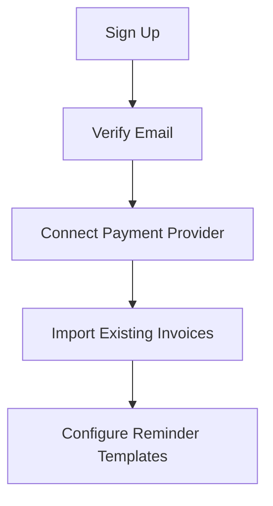
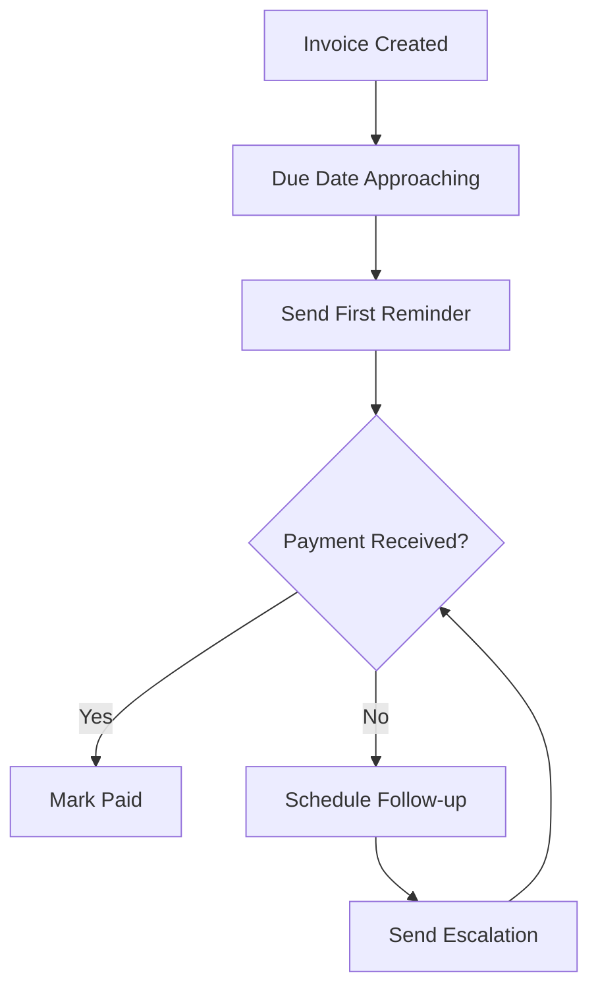

# Overview

DueSpark is a comprehensive invoice management platform designed to help freelancers, small businesses, and enterprises streamline their payment collection process through automated reminders and intelligent tracking.

## What is DueSpark?

DueSpark transforms the tedious process of invoice management into an automated, intelligent system that ensures you get paid on time. By combining smart scheduling, personalized communication, and detailed analytics, DueSpark helps businesses reduce late payments and improve cash flow.

## Key Features

### 📧 Automated Payment Reminders
- **Smart Scheduling**: Automatically send reminders based on invoice due dates
- **Customizable Templates**: Create personalized email templates for different scenarios
- **Multiple Channels**: Send reminders via email, SMS, or WhatsApp
- **Adaptive Timing**: AI-powered optimal send times based on recipient behavior

### 📊 Invoice Management
- **Complete Lifecycle**: Track invoices from creation to payment
- **Status Monitoring**: Real-time updates on payment status
- **Integration Support**: Import invoices from Stripe, QuickBooks, and other platforms
- **Bulk Operations**: Handle multiple invoices efficiently

### 👥 Client Management
- **Centralized Contacts**: Maintain detailed client information
- **Communication History**: Track all interactions and payment patterns
- **Relationship Insights**: Understand client payment behaviors
- **Segmentation**: Group clients for targeted communication

### 📈 Analytics & Insights
- **Payment Analytics**: Track payment success rates and timing
- **Email Performance**: Monitor open rates, click rates, and engagement
- **Cash Flow Forecasting**: Predict future payments based on historical data
- **Custom Reports**: Generate detailed reports for business insights

### 🔗 Integrations
- **Stripe Integration**: Seamless payment processing and invoice import
- **Email Providers**: Support for Postmark, SendGrid, AWS SES
- **Webhooks**: Real-time notifications for external systems
- **API Access**: Full REST API for custom integrations

## How It Works

### 1. Setup & Configuration

### 2. Automated Workflow

### 3. Monitoring & Optimization
- **Real-time Dashboard**: Monitor all active invoices and reminders
- **Performance Metrics**: Track success rates and identify bottlenecks
- **Continuous Improvement**: AI learns from your data to optimize timing and messaging

## Benefits

### For Freelancers
- ⚡ **Reduce Administrative Work**: Automate 80% of payment follow-up tasks
- 💰 **Improve Cash Flow**: Get paid 40% faster with automated reminders
- 🎯 **Professional Communication**: Maintain professional relationships with clients

### For Small Businesses
- 📊 **Scalable Operations**: Handle growing invoice volumes without additional staff
- 🔍 **Better Insights**: Understand payment patterns and client behaviors
- 🤝 **Team Collaboration**: Multiple users with role-based permissions

### For Enterprises
- 🏢 **Multi-tenant Support**: Manage multiple departments or subsidiaries
- 🔒 **Advanced Security**: Enterprise-grade security and compliance
- 📈 **Custom Analytics**: Advanced reporting and business intelligence

## Architecture

DueSpark is built with modern technologies for reliability and scalability:

### Backend
- **FastAPI**: High-performance Python web framework
- **PostgreSQL**: Reliable, ACID-compliant database
- **Redis**: Caching and session management
- **APScheduler**: Reliable job scheduling for reminders

### Frontend
- **React 18**: Modern, responsive user interface
- **TypeScript**: Type-safe development
- **Tailwind CSS**: Utility-first styling
- **PWA Support**: Mobile-first design with offline capabilities

### Infrastructure
- **Docker**: Containerized deployment
- **GitHub Actions**: Automated CI/CD pipeline
- **Multiple Deployment Options**: Cloud providers, self-hosting, or hybrid

## Security & Privacy

- 🔐 **End-to-End Encryption**: All sensitive data encrypted in transit and at rest
- 🛡️ **Authentication**: JWT-based secure authentication
- 🔒 **Role-Based Access**: Granular permissions and access control
- 📋 **GDPR Compliant**: Full compliance with data protection regulations
- 🔍 **Audit Logs**: Complete audit trail of all system activities

## Getting Started

Ready to transform your invoice management? Here are your next steps:

1. **[Quick Start Guide](./quickstart.md)**: Get up and running in 5 minutes
2. **[API Documentation](./api)**: Integrate DueSpark with your existing systems
3. **[Examples](./examples)**: See DueSpark in action with real scenarios
4. **[Support](https://support.duespark.com)**: Get help when you need it

## Community & Support

- **GitHub**: [Open source contributions](https://github.com/duespark/duespark)
- **Documentation**: Comprehensive guides and API reference
- **Community Forum**: Connect with other DueSpark users
- **Professional Support**: Enterprise support available

---

*Transform your invoice management today with DueSpark's intelligent automation and never chase payments manually again.*